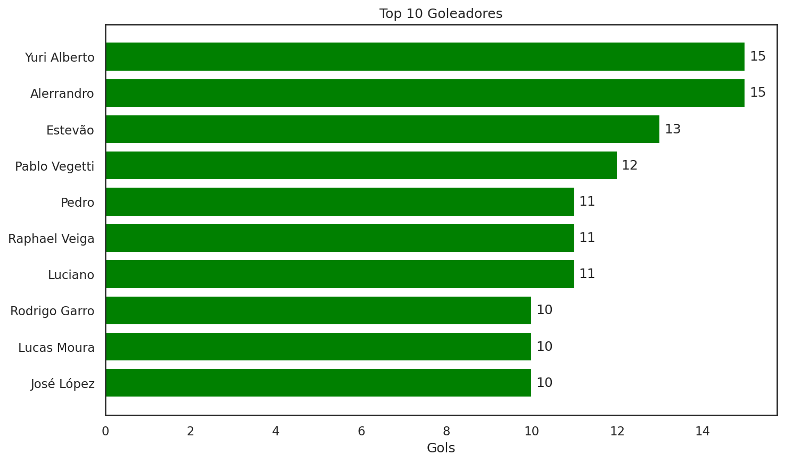
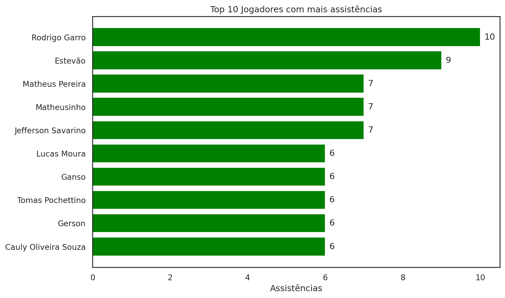
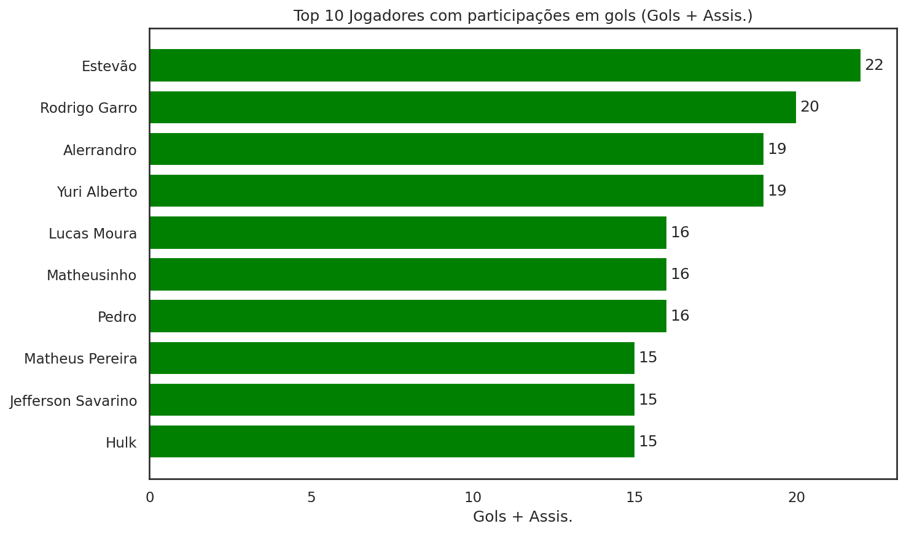
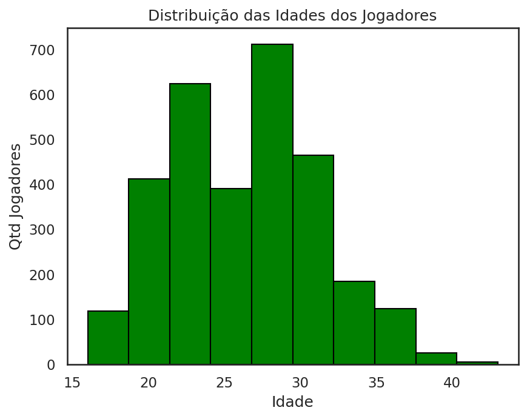

# 📊 Análise de Desempenho — Brasileirão Série A 2024

> *"Futebol é muito mais do que um jogo; é um universo de dados esperando para ser explorado."*

---

## 🎯 Sobre o Projeto

Análise exploratória de dados dos jogadores do **Brasileirão Série A 2024**, transformando estatísticas brutas em insights visuais sobre os atletas que mais se destacaram na competição.

O projeto cobre desde os maiores goleadores até a distribuição etária do campeonato, passando pelos melhores assistentes e os jogadores com mais participações em gols.

---

## 📌 Métricas Analisadas

| # | Análise | Descrição |
|---|---|---|
| 1 | 🥅 Top 10 Goleadores | Os jogadores com mais gols no campeonato |
| 2 | 🎯 Top 10 Assistências | Os jogadores com mais passes para gol |
| 3 | ⚡ Top 10 Participações em Gols | Gols + assistências combinados |
| 4 | 📊 Distribuição de Idades | Faixa etária dos jogadores do campeonato |

---

## 📈 Resultados e Visualizações

### 🥅 Top 10 Goleadores



---

### 🎯 Top 10 Assistências (Garçons)



---

### ⚡ Top 10 Participações em Gols



---

### 📊 Distribuição de Idades dos Jogadores



---

## 🛠️ Tecnologias Utilizadas


---

## 📁 Estrutura do Projeto

```
Desempenho-Jogadores-Brasileirao2024/
│
├── dataset.ipynb        # Notebook com toda a análise
├── database.csv         # Dataset com estatísticas dos jogadores
├── graficos/
│   ├── top10_goleadores.png
│   ├── top10_assistencias.png
│   ├── top10_participacoes.png
│   └── distribuicao_idades.png
└── README.md
```

---

## 🚀 Como Reproduzir

1. Clone o repositório:
```bash
git clone https://github.com/renansm95/Desempenho-Jogadores-Brasileirao2024.git
```

2. Instale as dependências:
```bash
pip install pandas matplotlib seaborn jupyter
```

3. Abra o notebook:
```bash
jupyter notebook dataset.ipynb
```

Ou acesse direto pelo Google Colab:

[](https://colab.research.google.com/github/renansm95/Desempenho-Jogadores-Brasileirao2024/blob/main/dataset.ipynb)

---

## 👤 Autor

**Renan Magalhães**

[](https://www.linkedin.com/in/renan-magalhaes95/)
[](https://github.com/renansm95)

---

Se curtiu o projeto, deixa uma ⭐ no repositório!
